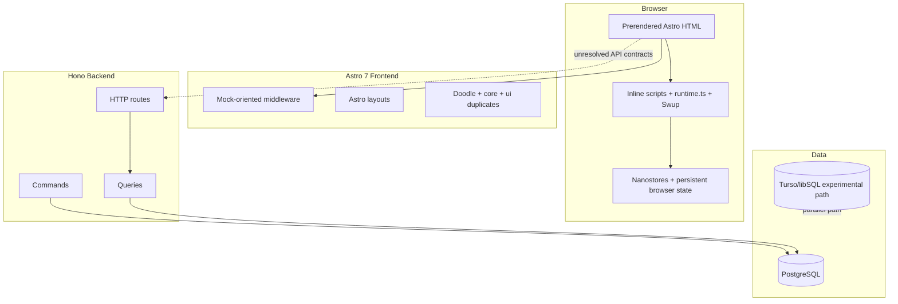
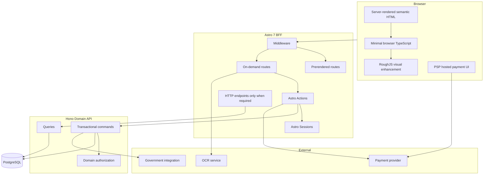
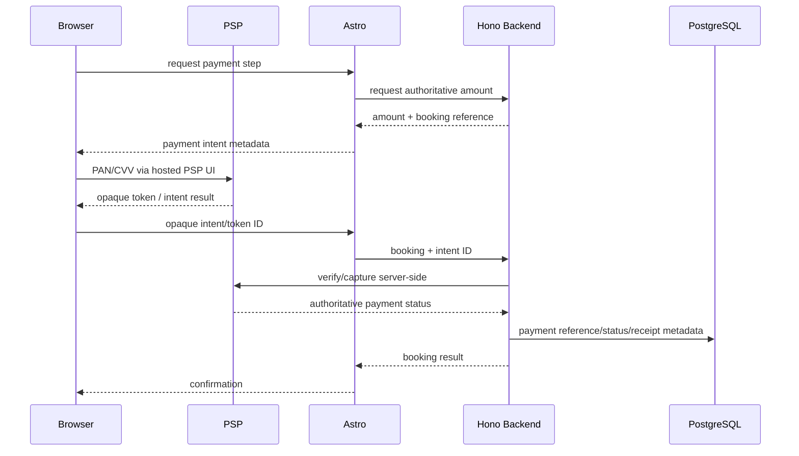
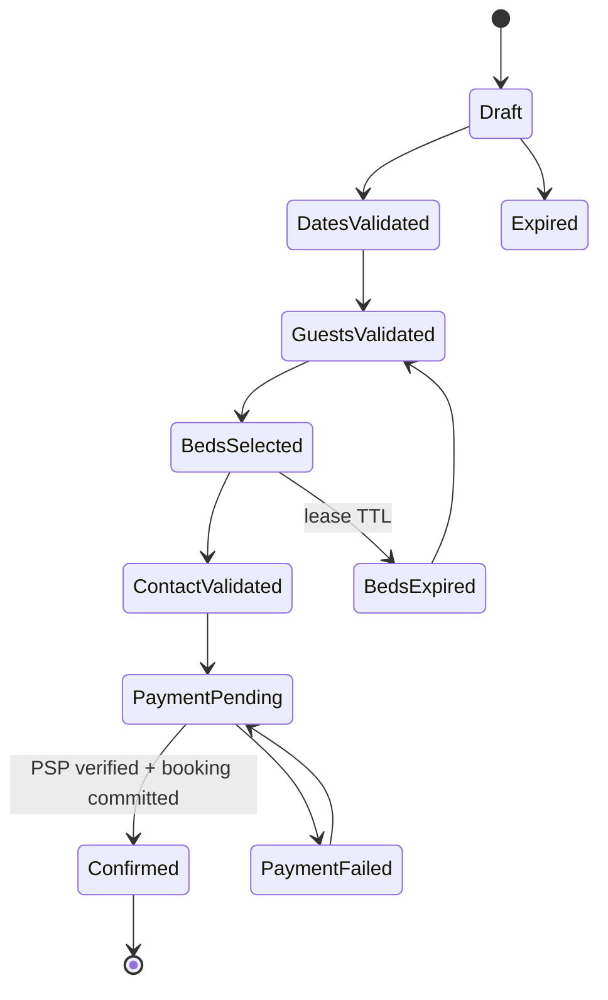
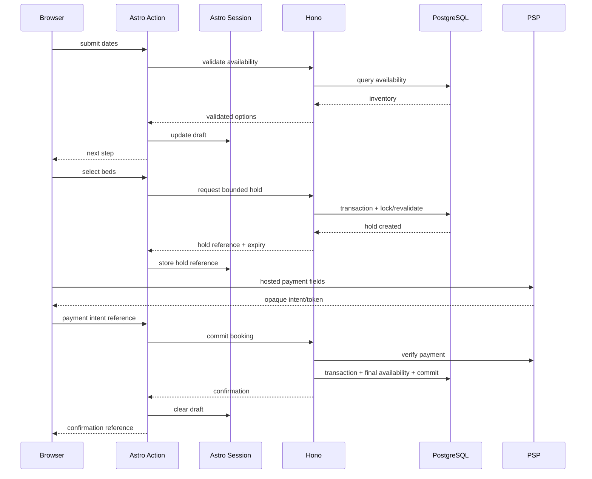
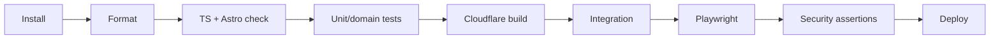
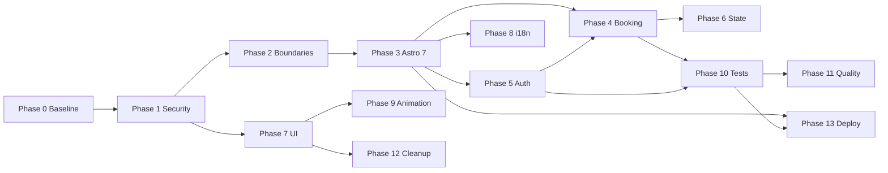
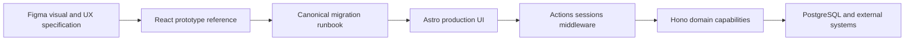
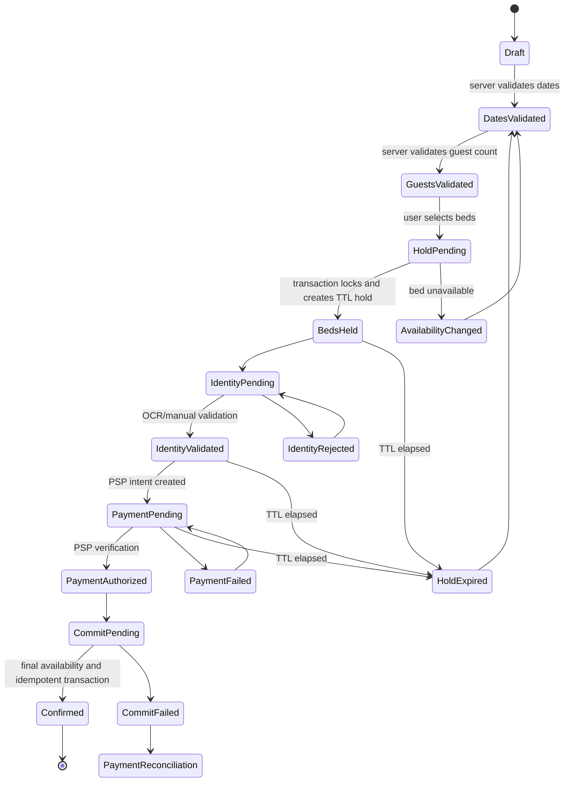
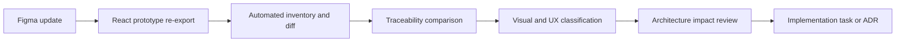

# Albergue Carrascalejo — Astro 7 Architecture Convergence & Migration Plan

> This document is the canonical migration and architecture execution runbook. Other Cursor plans, implementation notes and migration documents MUST defer to this document when conflicts exist.

## Amendment — ADR-UI-REACT (2026-09-19)

> **Supersedes**: INV-001; the "Introduce React" / "Introduce Tailwind" non-goals in §1.2; the "Do not import React, Tailwind, Radix, MUI, or Motion from `figma/`" hard rule in §A.5; the `webcoreui` KEEP decision and React/Tailwind rows in §F; the "no React/Radix/Tailwind dependency" DoD line under FIGMA-004; the "No React." line under §R Definition of Done → Frontend; and the §V.14 "Decisions made" bullet "Production stays React-free, Tailwind-free and server-first."

**Decision**: The production frontend adopts React 19.3, Tailwind v4, and Radix UI primitives for the Figma port, and removes `webcoreui`. `figma/` components are ported into `frontend/react/` (structure, tokens, and interaction logic reused directly) rather than re-implemented from scratch in Astro-native markup.

**Context**: This runbook's original React-free stance (§1.2, §A.5, §V.14) was written 2026-09-12. One week later the repository owner explicitly directed the opposite for a first slice of production UI ("Let use tailwindcss and react and react latest 19.3"; "we can remove webcoreui and use radixui like figma is doing") and it shipped to production: PR #22 (React/Tailwind/Radix primitives, admin Dashboard/BedManagement/BookingsTable, `webcoreui` removed) and PR #23 (UnoCSS/Tailwind scope fix, `@nanostores/react` wiring). When the conflict between this runbook and that shipped work was surfaced directly, the owner re-confirmed: keep React/Tailwind/Radix rather than reverting the merged work.

**Consequences**:
- INV-001 is retired. The frontend is not React-free; React is scoped to interactive islands (`client:load`) — Astro remains the server-first rendering/routing layer for everything else (SSR/prerendering, Actions, sessions, middleware are unaffected by this amendment).
- Astro components still own plain-HTML/content-only surfaces (legal pages, static marketing sections) where no interactivity is needed — this amendment does not mandate React everywhere, only where `figma/` React components are the direct port source.
- `webcoreui` is removed, not "KEEP constrained" as §F stated.
- `default_shadcn_theme.css` is no longer "reference-only" (§V.8) — it is the live token source for ported components (see `frontend/src/styles/shadcn-theme.css`, corrected to Figma's actual brand palette in PR #24 rather than shadcn's generic defaults).
- All other sections of this runbook (security, booking state machine, auth, i18n, testing, deployment) remain in force and are unaffected by this amendment.

---

## 0. Executive Summary

This document is the authoritative migration and architecture runbook for Albergue Carrascalejo.

It explicitly supersedes the previous React SPA → Astro microfrontends migration model.

The repository is already an Astro application. The migration objective is therefore not framework replacement; it is architectural convergence around the system that actually exists:

- Astro 7.3.2 server-first frontend.
- `output: 'server'` with selective `export const prerender = true`.
- No React runtime in the production frontend.
- No production TSX/component hydration architecture.
- Hono backend owning business capabilities.
- Drizzle ORM + PostgreSQL as production persistence.
- `domain_model/schema.ts` as the authoritative TypeScript schema.
- Cloudflare as the primary Astro deployment target.
- Netlify as secondary portability target.
- Node/Stormkit as tertiary runtime.
- Plain CSS, UnoCSS, WebCoreUI, RoughJS and selective browser TypeScript.
- Astro Actions, sessions and middleware as the frontend BFF primitives.

The migration follows one rule:

> Move authority from the browser toward trusted server boundaries while reducing duplicate architecture.

Priority order:

1. Security and correctness.
2. Domain/API boundaries.
3. Astro 7 server architecture.
4. Booking and authentication.
5. State reduction.
6. UI/i18n convergence.
7. Performance and animation.
8. Testing and CI.
9. Cleanup and deployment convergence.

---

## 1. Goals

### 1.1 Primary goals

- Eliminate browser persistence of payment data and sensitive PII.
- Make booking, pricing, availability and bed allocation server-authoritative.
- Protect `/admin/**` at both frontend and backend boundaries.
- Establish one frontend ↔ backend contract.
- Adopt Astro Actions for application form mutations.
- Adopt Astro sessions for bounded workflow/session state.
- Establish server-verified authentication and RBAC.
- Remove client JWT authorization decisions.
- Reduce Nanostores to transient, non-sensitive UI state.
- Consolidate the doodle component/design system.
- Establish one i18n routing/catalog pipeline.
- Reduce global browser JavaScript.
- Rebuild CI around the repository that actually exists.
- Establish a meaningful automated test pyramid.
- Preserve multi-adapter portability without reducing Cloudflare quality.

### 1.2 Non-goals

This migration will not:

- Introduce React.
- Convert Astro components to React islands.
- Introduce a microfrontend runtime.
- Introduce Tailwind.
- Reintroduce `output: 'hybrid'` terminology/configuration.
- Store PAN, CVV or raw payment credentials.
- Treat decoded JWT contents as authorization evidence.
- Make browser state authoritative for price, availability or booking status.
- Merge the Figma reference application into production.
- Make the Rust/Turso path production-of-record without a separate ADR.
- Couple Astro application code directly to one hosting provider where a clean abstraction is practical.

---

## 2. Architectural Invariants

The following are hard constraints.

| ID      | Invariant                                                                                       |
| ------- | ----------------------------------------------------------------------------------------------- |
| INV-001 | Production frontend remains React-free unless a future ADR demonstrates a concrete requirement. |
| INV-002 | PAN/CVV never traverse Astro, Hono, logs, telemetry or application persistence.                 |
| INV-003 | PII is never persisted in `localStorage`, `sessionStorage` or persistent Nanostores.            |
| INV-004 | Browser price, availability, entitlement and authorization data are advisory only.              |
| INV-005 | Backend revalidates privileged and financial operations.                                        |
| INV-006 | `/admin/**` is on-demand and server-authorized.                                                 |
| INV-007 | Redis credentials and server secrets never enter the browser bundle.                            |
| INV-008 | `domain_model/schema.ts` remains schema authority until an ADR changes ownership.               |
| INV-009 | Cloudflare compatibility is tested for every server-side frontend feature.                      |
| INV-010 | Static routes remain prerendered unless runtime data/auth requires on-demand rendering.         |
| INV-011 | Client JS must justify itself through interaction requirements.                                 |
| INV-012 | Decorative RoughJS output must not damage semantic HTML or accessibility.                       |

---

# A. Current Architecture

## A.1 Repository topology

The repository is a pnpm monorepo.

```text
.
├── frontend/                 # Astro 7.3.2 production frontend
├── backend/                  # Hono + Drizzle + PostgreSQL domain API
├── domain_model/             # Authoritative schema/migrations + parallel Rust experiments
├── figma/                    # React/Vite design reference only
├── packages/
│   └── astro-roughjs/        # Experimental/incomplete RoughJS integration
├── .github/workflows/
├── pnpm-workspace.yaml
└── tree.md
```

| Package                   | Responsibility                      | Runtime status                    |
| ------------------------- | ----------------------------------- | --------------------------------- |
| `frontend/`               | Astro web application/BFF           | Production                        |
| `backend/`                | Hono domain API                     | Production architecture           |
| `domain_model/`           | Drizzle schema and SQL migrations   | Authoritative schema              |
| `domain_model/rust/`      | SeaORM/Seaography/libSQL/Turso path | Parallel/experimental pending ADR |
| `figma/`                  | Visual/design reference             | Non-production                    |
| `packages/astro-roughjs/` | RoughJS abstraction experiment      | Incomplete pending ADR            |

## A.2 Frontend runtime

Current production frontend characteristics:

- Astro `7.3.2`.
- `output: 'server'`.
- 16/17 observed routes explicitly prerendered.
- No production React runtime.
- No `client:*` framework hydration directives.
- Browser behavior implemented using inline scripts and TypeScript modules.
- Nanostores currently used for client state.
- Swup currently participates in navigation.
- Astro prefetch also participates in navigation.
- RoughJS implements the doodle visual language.
- UnoCSS is available for utility generation.
- WebCoreUI is available for selected primitives.

This means the actual rendering architecture is:

```text
Astro server output
       |
       +-- prerender=true -> static artifact
       |
       +-- prerender=false/default server -> on-demand route
                                         |
                                         +-- optional minimal browser TS
```

## A.3 Backend

```text
backend/src/
├── commands/
├── queries/
├── routes/
└── ...
```

Observed architectural problem:

```text
commands exist
    |
    X  many are not exposed
    |
routes are read-heavy
```

The UI therefore has no reliable application boundary for several workflows.

## A.4 Domain model

`domain_model/schema.ts` is the current authoritative TypeScript persistence schema.

The repository also contains:

```text
domain_model/src/commands
domain_model/src/queries
```

These are excluded from the package build and duplicate backend concepts.

The Rust subtree represents a second persistence/application direction and must not silently become a second production authority.

## A.5 Figma workspace — design source of truth

The UI was designed in Figma and exported as a runnable prototype under `figma/`.

| Artifact          | Path                                                                                                                                 | Role                                                  |
| ----------------- | ------------------------------------------------------------------------------------------------------------------------------------ | ----------------------------------------------------- |
| Figma design file | [Albergue Carrascalejo Prototype (Copy)](https://www.figma.com/design/nhtyfIO6mEsebEyAJtfjVB/Albergue-Carrascalejo-Prototype--Copy-) | Canonical visual design                               |
| Prototype runtime | [`figma/package.json`](../../package.json)                                                                                           | React/Vite reference (Tailwind 4, Motion, Radix, MUI) |
| Route map         | [`figma/src/app/App.tsx`](App.tsx)                                                                                                   | Complete application routes and shell                 |
| Doodle system     | [`DOODLE_DESIGN_SYSTEM.md`](DOODLE_DESIGN_SYSTEM.md)                                                                                 | Component API, colors, typography                     |
| Dev guidelines    | [`figma/guidelines/Guidelines.md`](../../guidelines/Guidelines.md)                                                                   | Constraints (fonts, palette, motion)                  |
| This runbook      | `MIGRATION_PLAN.md`                                                                                                                  | Figma → Astro migration + architecture convergence    |

### Design authority chain

```text
Figma design file
    ↓ Figma Make export
figma/ React prototype          ← interaction, copy, layout reference
    ↓ extract tokens/flows      ← NOT a React port
frontend/ Astro production      ← authoritative runtime
```

### Hard rules

- Do **not** import React, Tailwind, Radix, MUI, or Motion from `figma/` into `frontend/`.
- Do **not** merge `figma/` into the pnpm workspace production build.
- Extract: design tokens, page structure, booking step order, admin IA, legal content, i18n strings, motion _intent_.
- Re-implement with: Astro components, plain CSS/UnoCSS, RoughJS, WebCoreUI where justified, Astro Actions/sessions.

### Implementation gap (current)

| Area         | Figma (`figma/src/app/`)                        | Frontend (`frontend/src/`)                 |
| ------------ | ----------------------------------------------- | ------------------------------------------ |
| Components   | ~101 TSX files                                  | ~9 doodle `.astro` + scattered stubs       |
| Booking      | 6-step `NewBookingFlow` with OCR, beds, payment | Static form mock on `book.astro`           |
| Admin        | Dashboard, bookings table, bed management       | Mock prerendered pages; missing sub-routes |
| Legal        | Privacy, terms, cookies, legal notice (ES+EN)   | Not implemented                            |
| i18n         | `I18nContext` + `LanguageSelector`              | Broken `i18nStore`; hardcoded strings      |
| Auth         | `AuthContext` + `LoginModal`                    | Client JWT store; no `/auth` page          |
| Info/tourism | Tourism, restaurants, emergencies, visits pages | Not implemented                            |

### Route migration matrix (from `App.tsx`)

| Figma route                     | Figma component             | Frontend status          | Astro target        |
| ------------------------------- | --------------------------- | ------------------------ | ------------------- |
| `/`                             | `HomePage`                  | `index.astro` partial    | Prerender           |
| `/book`                         | `NewBookingFlow`            | mock `book.astro`        | On-demand + Actions |
| `/dashboard`                    | `GuestDashboard`            | static `dashboard.astro` | On-demand + auth    |
| `/admin`                        | `AdminLayout` + `Dashboard` | mock, public             | On-demand + RBAC    |
| `/admin/bookings`               | `BookingsTable`             | missing                  | create              |
| `/admin/beds`                   | `BedManagement`             | missing                  | create              |
| `/privacidad`, `/privacy`       | `PrivacyPolicy`             | missing                  | Content Collection  |
| `/terminos`, `/terms`           | `TermsAndConditions`        | missing                  | Content Collection  |
| `/cookies`                      | `CookiePolicy`              | missing                  | Content Collection  |
| `/aviso-legal`, `/legal-notice` | `LegalNotice`               | missing                  | Content Collection  |
| nav `/auth`                     | `LoginModal`                | missing page             | Action + session    |

Additional Figma pages not in `App.tsx` routes but linked from `HomePage`: `TourismPage`, `RestaurantsPage`, `EmergenciesPage`, `VisitsPage`, `VisualAreaShowcase`, `LocalAreaShowcase`, `MeridaShowcase` — plan as `/info/*` or dedicated routes in Phase 7.

### Booking step mapping (Figma → Astro)

| Step | Figma                                  | Astro target                           | Server authority                |
| ---: | -------------------------------------- | -------------------------------------- | ------------------------------- |
|    1 | `DatePickerStep` / `HandDrawnCalendar` | `components/booking/DateStep.astro`    | availability API                |
|    2 | `IDUploadStep`                         | `components/booking/IdUpload.astro`    | OCR Action; no client PII store |
|    3 | `PilgrimFormStep`                      | `components/booking/PilgrimForm.astro` | session + validation            |
|    4 | `BedSelectionStep` / `DoodleBed`       | `components/booking/BedGrid.astro`     | bed lock transaction            |
|    5 | `PaymentStep`                          | `components/booking/Payment.astro`     | PSP hosted fields only          |
|    6 | `PriceSummaryModal`                    | `booking-confirmed.astro`              | backend commit                  |

Replace Figma `useState` booking machine and hardcoded `pricePerNight = 10` with Astro session + backend pricing.

### Component extraction priorities

| Figma doodle component   | Astro status                | Action                              |
| ------------------------ | --------------------------- | ----------------------------------- |
| `DoodleCard.tsx`         | `DoodleCard.astro` exists   | Align API                           |
| `WiredButton.tsx`        | `DoodleButton.astro` exists | Align variants                      |
| `HandDrawnCalendar.tsx`  | missing                     | **FIGMA-004**                       |
| `IDUpload.tsx`           | missing                     | **FIGMA-004**                       |
| `DoodleBed.tsx`          | missing                     | **FIGMA-004**                       |
| `PhoneInput.tsx`         | missing                     | **FIGMA-004**                       |
| `AnimatedBackground.tsx` | partial pattern             | CSS/RoughJS; respect reduced motion |

### Token reconciliation ADR

Three sources must converge (FIGMA-001):

- `figma/guidelines/Guidelines.md` — green/grey; strict palette rules
- `DOODLE_DESIGN_SYSTEM.md` — status colors (blue/yellow/red)
- `frontend/src/styles/design-system.css` — current production

Figma/Guidelines win for brand; DOODLE_DESIGN_SYSTEM exceptions documented for booking status only.

## A.6 Integration gap

Current conceptual mismatch:

```text
Frontend
  /api/user/*
  /api/gateway/*
  /api/auth/*
       |
       X missing local implementation
       |
Backend
  /api/bookings
  /api/pilgrims
  ...
```

The migration must establish one explicit BFF/domain boundary rather than creating additional client workarounds.

## A.7 CI drift

Current CI references architecture that is not present in the active workspace, including gateway/spin assumptions.

```text
[stale CI topology]
    -> [important code is not validated]
    -> [false confidence]
```

## A.8 Current architecture



## A.9 Verdict

This is not a React SPA migration.

The target is an Astro-native server-first architecture with progressive enhancement and a Hono domain backend.

---

# B. Architectural Problems

## B.1 P0 — Security and correctness blockers

| ID      | Problem                             | Cause -> Impact -> Remediation                                                                                                    |
| ------- | ----------------------------------- | --------------------------------------------------------------------------------------------------------------------------------- |
| SEC-001 | Payment data in browser persistence | Raw payment fields in booking state -> XSS/shared-device/PCI exposure -> delete raw fields and use PSP tokenization/hosted fields |
| SEC-002 | PII persisted client-side           | Persistent booking/pilgrim stores -> GDPR/privacy exposure -> server workflow state with minimum necessary data                   |
| SEC-003 | Public admin                        | Prerendered admin routes without server gate -> unauthorized UI/data exposure -> on-demand rendering + middleware + backend RBAC  |
| SEC-004 | Booking writes not atomic           | create booking and bed update outside one transaction -> double booking/ghost state -> transaction + lock/revalidation            |
| SEC-005 | Invalid multi-ID predicates         | equality predicates combined for multiple IDs -> silent command failure -> `inArray()` + tests                                    |
| SEC-006 | Redis located in frontend           | server TCP client in frontend package -> runtime incompatibility/secret risk -> move capability behind backend/server boundary    |

## B.2 P1 — Architectural blockers

| ID       | Cause -> Impact -> Remediation                                                                             |
| -------- | ---------------------------------------------------------------------------------------------------------- |
| ARCH-004 | No canonical API contract -> frontend/backend drift -> shared DTO/OpenAPI boundary                         |
| ARCH-005 | Write commands not exposed -> UI cannot use authoritative domain logic -> expose controlled Hono mutations |
| ARCH-006 | Duplicate dead domain commands -> implementation drift -> archive/remove                                   |
| ARCH-007 | Parallel Rust persistence path undefined -> dual authority risk -> ADR                                     |
| ARCH-008 | Phantom auth types/providers -> ambiguous security model -> choose/remove                                  |

## B.3 P2 — Maintainability/performance

- Duplicate component hierarchies.
- Multiple localization mechanisms.
- Swup + Astro navigation overlap.
- Multiple RoughJS integration paths.
- Narrow typecheck scope.
- Stale React-era tests.
- Optional heavy Three.js dependency with no proven production route.

## B.4 P3 — Cleanup

- Demo routes in production namespace.
- Dead components/layouts.
- Unused dependencies.
- Duplicate assets.
- Multiple lint configurations.
- Figma runtime adjacent to production source tree.

---

# C. Target Architecture

## C.1 Architecture



## C.2 Ownership matrix

| Capability    | Browser                     | Astro               | Hono backend                 | PostgreSQL/external            |
| ------------- | --------------------------- | ------------------- | ---------------------------- | ------------------------------ |
| Render UI     | ✓                           | ✓                   |                              |                                |
| Form UX       | ✓                           |                     |                              |                                |
| Booking draft | opaque/local transient only | session coordinator | validate                     | durable booking when committed |
| Price         | display only                | relay               | authoritative                | pricing tables                 |
| Availability  | display only                | relay               | authoritative                | beds/bookings                  |
| Bed lock      | request only                | coordinate          | authoritative                | transaction/lease state        |
| Auth identity | display only                | verified session    | verify privileged action     | auth persistence               |
| RBAC          | never authoritative         | route gate          | authoritative operation gate | role data                      |
| Payment       | PSP SDK/redirect            | intent coordination | verify/capture workflow      | PSP                            |
| PAN/CVV       | PSP only                    | forbidden           | forbidden                    | forbidden in app DB            |

## C.3 Actions vs endpoints vs backend

| Need                           | Mechanism                                                             |
| ------------------------------ | --------------------------------------------------------------------- |
| Astro form mutation            | Astro Action                                                          |
| Login/logout form              | Astro Action                                                          |
| Booking step submission        | Astro Action                                                          |
| Admin form mutation            | Astro Action calling authorized backend operation                     |
| Webhook                        | Astro/Hono HTTP endpoint                                              |
| Health check                   | HTTP endpoint                                                         |
| SSE/stream                     | HTTP endpoint                                                         |
| Third-party callback           | HTTP endpoint                                                         |
| Domain command                 | Hono backend                                                          |
| Domain query                   | Hono backend                                                          |
| Same-process Node optimization | direct service call only when architectural boundary remains explicit |

---

# D. Security and Trust Boundaries

## D.1 Payment boundary



Hard rules:

- PAN never enters Astro request bodies.
- CVV never enters Astro request bodies.
- PAN/CVV never enter Hono.
- PAN/CVV never enter logs.
- PAN/CVV never enter session storage.
- PAN/CVV never enter PostgreSQL.
- Store PSP identifiers, status, brand/last4 only where contractually and legally appropriate.

## D.2 PII rules

| Class           | Examples                         |  Browser persistence |                           Astro session |                       Durable DB |
| --------------- | -------------------------------- | -------------------: | --------------------------------------: | -------------------------------: |
| Public          | locale, theme                    |              allowed |                                 allowed |                         optional |
| Operational     | booking step, anonymous draft ID |  avoid unless needed |                                 allowed |                         optional |
| PII             | name, passport/DNI, contact      | forbidden persistent |                       minimum necessary |             encrypted/controlled |
| Sensitive       | health/accessibility notes       |            forbidden | minimum necessary with retention policy | controlled/encrypted if required |
| Payment secrets | PAN/CVV                          |            forbidden |                               forbidden |                        forbidden |

## D.3 Authentication model

```text
credential exchange
    -> server verifies
    -> opaque session established
    -> HttpOnly + Secure + appropriate SameSite cookie
    -> Astro middleware resolves identity
    -> Astro.locals.user / role
    -> backend repeats authorization for privileged operation
```

The frontend route gate is defense in depth, not the final authorization boundary.

## D.4 CSRF

Cookie-authenticated mutations require CSRF protection appropriate to the chosen session/auth architecture.

Required controls:

- SameSite cookie policy.
- Origin/host validation where appropriate.
- CSRF token pattern for state-changing browser forms where required by the final auth design.
- No state-changing GET endpoints.
- Backend reauthorization.

---

# E. Rendering Matrix

| Route                | Current               | Target                                       | Auth                         | Server authority             | Client JS       |
| -------------------- | --------------------- | -------------------------------------------- | ---------------------------- | ---------------------------- | --------------- |
| `/`                  | prerender             | prerender                                    | no                           | none                         | RoughJS/minimal |
| `/info`              | prerender             | prerender                                    | no                           | content                      | minimal         |
| `/404`               | prerender             | prerender                                    | no                           | none                         | none            |
| `/book`              | prerender/mock        | on-demand                                    | guest session                | booking/pricing/availability | form UX         |
| `/booking`           | duplicate/placeholder | redirect or merge                            | varies                       | booking                      | none            |
| `/booking-confirmed` | mixed                 | on-demand                                    | booking capability/reference | booking result               | none/minimal    |
| `/camino`            | prerender             | prerender shell or on-demand if personalized | optional                     | progress API                 | selective       |
| `/dashboard`         | inconsistent          | on-demand when personalized                  | pilgrim                      | user data                    | minimal         |
| `/camino-dashboard`  | demo                  | `/demo/camino-dashboard`                     | no                           | mock                         | selective       |
| `/auth`              | missing/incomplete    | on-demand                                    | no                           | auth service                 | form only       |
| `/admin`             | unsafe prerender      | on-demand                                    | admin                        | backend + session            | minimal         |
| `/admin/**`          | unsafe prerender      | on-demand                                    | admin                        | backend + session            | minimal         |
| `/demo-*`            | production namespace  | `/demo/**` + environment gate                | no                           | mock                         | varies          |
| legal pages          | future                | prerender                                    | no                           | Content Layer                | none            |

Route migration checklist:

- [ ] classify every route static/on-demand.
- [ ] remove `prerender=true` from authenticated routes.
- [ ] move demos under `/demo/`.
- [ ] ensure confirmation cannot enumerate bookings.
- [ ] ensure dashboards do not embed private data in prerender output.
- [ ] add auth tests for every protected route family.

---

# F. Dependency Decision Matrix

| Package                     | Version    | Decision                                  | Target role                                    |
| --------------------------- | ---------- | ----------------------------------------- | ---------------------------------------------- |
| `astro`                     | `^7.3.2`   | KEEP                                      | framework                                      |
| `@astrojs/cloudflare`       | `^14.3.1`  | KEEP                                      | primary adapter                                |
| `@astrojs/netlify`          | `^8.2.5`   | KEEP                                      | secondary adapter                              |
| `@astrojs/node`             | `^11.1.5`  | KEEP                                      | Node/Stormkit adapter                          |
| `@swup/astro`               | `^1.8.0`   | ADR                                       | remove if native navigation meets requirements |
| `@unocss/vite`              | `^66.10.1` | KEEP                                      | utility CSS build integration                  |
| `unocss`                    | `^66.10.1` | KEEP                                      | utility CSS                                    |
| `webcoreui`                 | `^1.5.0`   | KEEP constrained                          | generic primitives                             |
| `roughjs`                   | `^4.6.6`   | KEEP                                      | doodle identity                                |
| `animejs`                   | `^4.5.0`   | INVESTIGATE                               | complex animation only                         |
| `three`                     | `^0.186.0` | INVESTIGATE/REMOVE                        | dedicated 3D only                              |
| `nanostores`                | `^1.5.3`   | KEEP constrained                          | transient UI state                             |
| `@nanostores/persistent`    | `^1.3.5`   | REMOVE from sensitive workflows           | no PII persistence                             |
| `@supabase/supabase-js`     | `^2.116.0` | REMOVE unless ADR establishes requirement | currently unused                               |
| `jwt-decode`                | `^4.0.0`   | REMOVE from auth decisions                | parsing is not verification                    |
| `redis`                     | `^6.2.1`   | REMOVE from frontend                      | backend/server capability only                 |
| `clsx`                      | `^2.1.1`   | REMOVE if grep confirms unused            | unnecessary                                    |
| `@astrojs/markdown-satteri` | `^0.4.1`   | INVESTIGATE                               | only if Content Layer requirement exists       |
| `astro-icon`                | `^1.2.0`   | KEEP                                      | icons                                          |
| `sass`                      | `1.100.0`  | KEEP constrained                          | WebCore/config SCSS only                       |
| `typescript`                | `6.0.3`    | KEEP                                      | compiler                                       |
| `@typescript/typescript6`   | `^6.0.2`   | KEEP pending toolchain ADR                | `tsc6` workflow                                |
| `vitest`                    | `^5.0.0`   | KEEP                                      | unit/integration tests                         |
| `@playwright/test`          | `^1.63.0`  | KEEP                                      | browser journeys                               |
| `wrangler`                  | `^4.131.0` | KEEP                                      | Cloudflare build/deploy                        |

---

# G. Repository Consolidation

## G.1 Consolidation map

| Current                            | Target                      | Action                    |
| ---------------------------------- | --------------------------- | ------------------------- |
| `frontend/src/components/doodle/*` | same                        | canonical                 |
| root `Button/Card/Hero`            | doodle/core                 | remove after import trace |
| `components/core/*`                | same                        | retain primitives         |
| `components/ui/*`                  | core/domain                 | consolidate               |
| `components/layout/*`              | layouts/partials            | consolidate               |
| root `DoodleCard.astro`            | doodle version              | remove duplicate          |
| `src/islands/*`                    | none unless proven          | remove/investigate        |
| `stores/redis.ts`                  | backend server module       | move/remove               |
| `bookingStore.ts`                  | Actions + session           | replace                   |
| `pilgrim*.ts`                      | session/backend             | replace                   |
| `i18nStore.ts`                     | Astro i18n/catalog          | replace                   |
| PO + Wuchale + JSON loaders        | one catalog pipeline        | consolidate               |
| `packages/astro-roughjs`           | package or frontend library | ADR                       |
| `domain_model/src/commands         | queries`                    | backend                   | archive/remove |
| React-era tests                    | Astro/domain tests          | replace                   |
| `figma/`                           | documented design reference | isolate                   |

## G.2 Target frontend structure

```text
frontend/src/
├── actions/
│   ├── auth/
│   ├── booking/
│   ├── admin/
│   └── index.ts
├── components/
│   ├── core/
│   ├── doodle/
│   ├── booking/
│   ├── dashboard/
│   ├── admin/
│   ├── legal/
│   └── shared/
├── content/
│   └── legal/
├── i18n/
├── layouts/
├── lib/
├── middleware/
├── pages/
├── scripts/
├── stores/
│   └── ui.ts
├── styles/
├── types/
├── content.config.ts
├── env.d.ts
└── middleware.ts
```

`src/middleware.ts` remains the Astro middleware entry point.

```ts
import { sequence } from "astro:middleware";
import { authMiddleware } from "./middleware/auth";
import { localeMiddleware } from "./middleware/locale";
import { requestIdMiddleware } from "./middleware/request-id";
import { securityMiddleware } from "./middleware/security";

export const onRequest = sequence(
  requestIdMiddleware,
  securityMiddleware,
  localeMiddleware,
  authMiddleware,
);
```

---

# H. Migration Issue Index

| ID              | Phase | Priority | Owner               | Depends on          | Validation artifact                       |
| --------------- | ----: | -------- | ------------------- | ------------------- | ----------------------------------------- |
| ARCH-001        |     0 | P0       | Architecture        | —                   | baseline doc                              |
| ARCH-002        |     0 | P0       | Platform            | —                   | green CI                                  |
| TEST-001        |     0 | P0       | QA/Frontend         | ARCH-002            | smoke report                              |
| ARCH-003        |     0 | P0       | Frontend            | —                   | typecheck coverage                        |
| SEC-001         |     1 | P0       | Frontend/Security   | Phase 0             | storage audit                             |
| SEC-002         |     1 | P0       | Frontend/Security   | SEC-001             | PII storage test                          |
| SEC-003         |     1 | P0       | Frontend/Security   | Phase 0             | admin denial E2E                          |
| SEC-004         |     1 | P0       | Backend             | Phase 0             | concurrency test                          |
| SEC-005         |     1 | P0       | Backend             | Phase 0             | bulk command tests                        |
| SEC-006         |     1 | P0       | Platform/Frontend   | Phase 0             | dependency audit                          |
| ARCH-004        |     2 | P1       | Architecture        | Phase 1             | API contract                              |
| ARCH-005        |     2 | P1       | Backend             | ARCH-004            | write integration test                    |
| ARCH-006        |     2 | P1       | Backend             | ARCH-004            | dead-code report                          |
| ARCH-007        |     2 | P1       | Architecture        | Phase 1             | ADR                                       |
| ARCH-008        |     2 | P1       | Security            | Phase 1             | auth dependency audit                     |
| ASTRO-001       |     3 | P1       | Frontend/Platform   | Phase 2             | env build test                            |
| ASTRO-002       |     3 | P1       | Platform            | ASTRO-001           | adapter session test                      |
| ASTRO-003       |     3 | P1       | Frontend            | ARCH-005, ASTRO-002 | Action integration tests                  |
| ASTRO-004       |     3 | P1       | Security/Frontend   | ASTRO-002           | header/auth tests                         |
| ASTRO-005       |     3 | P1       | Frontend            | ARCH-004            | endpoint contract tests                   |
| ASTRO-006       |     3 | P2       | Frontend            | Phase 0             | navigation ADR                            |
| BOOK-001..006   |     4 | P1       | Full-stack          | Phase 3             | booking journey suite                     |
| AUTH-001..005   |     5 | P1       | Security/Full-stack | Phase 3             | auth suite                                |
| STATE-001..006  |     6 | P2       | Frontend            | Phases 4–5          | storage/state audit                       |
| FIGMA-001..008  |     7 | P1       | Design/Frontend     | Phase 1, Phase 3    | Figma route checklist + visual regression |
| UI-001..005     |     7 | P2       | Frontend/Design     | FIGMA-001           | visual/a11y tests                         |
| I18N-001..006   |     8 | P2       | Frontend/Content    | Phase 3             | locale matrix                             |
| PERF-001..005   |     9 | P2       | Frontend            | Phase 7             | bundle/perf report                        |
| TEST-002..005   |    10 | P1       | QA/Engineering      | Phases 4–5          | CI test reports                           |
| PERF-006..007   |    11 | P2       | SRE/Frontend        | Phase 10            | Web Vitals budget                         |
| A11Y-001        |    11 | P1       | Frontend/QA         | Phase 7             | accessibility report                      |
| SEO-001         |    11 | P2       | Frontend            | Phase 8             | SEO validation                            |
| CLEAN-001..005  |    12 | P3       | Engineering         | Phase 7             | cleanup report                            |
| DEPLOY-001..005 |    13 | P1       | Platform/SRE        | Phases 3,10         | deployment matrix                         |

---

# I. Migration Phases

## Phase 0 — Baseline and Safety Net

### Objective

Make CI, type checking and test gates describe the real repository before changing architecture.

### ARCH-001 — Architecture baseline

Document:

- package topology;
- rendering inventory;
- route inventory;
- dependency inventory;
- data-flow inventory;
- trust boundaries;
- deployment adapters;
- unresolved ADRs.

### ARCH-002 — Repair CI topology

Minimum frontend CI:

```bash
pnpm install --frozen-lockfile
pnpm --filter albergue-carrascalejo-frontend format:check
pnpm --filter albergue-carrascalejo-frontend type-check
pnpm --filter albergue-carrascalejo-frontend check:astro
pnpm --filter albergue-carrascalejo-frontend build:cloudflare
pnpm --filter albergue-carrascalejo-frontend e2e
```

### TEST-001 — Smoke gate

Critical routes:

- `/`
- `/info`
- `/book`
- `/admin`
- 404

### ARCH-003 — Expand typecheck

Expand checking until all production Astro/TS source participates.

### Acceptance

- CI reflects actual repository topology.
- Full active frontend participates in type validation.
- Smoke tests run on PRs.
- Cloudflare build is mandatory.

---

## Phase 1 — Security and Correctness

### SEC-001 — Remove raw payment fields

```bash
rg -n "cardNumber|cvv|cvc|pan|expiryDate" frontend/src backend/src
```

Target state:

```ts
export interface PaymentSelection {
  provider: "psp";
  paymentIntentId?: string;
  status?: "pending" | "authorized" | "failed";
}
```

### SEC-002 — Remove PII persistence

Delete persistent browser storage for:

- identity documents;
- contact data where unnecessary;
- accessibility/health information;
- authentication tokens;
- personal booking data.

### SEC-003 — Protect admin

```astro
---
export const prerender = false;
---
```

All `/admin/**` routes require middleware and backend authorization.

### SEC-004 — Transactional booking

```ts
await db.transaction(async (tx) => {
  const bed = await loadBedForUpdate(tx, input.bedId);

  if (!bed || !isAvailable(bed, input.range)) {
    throw new BedUnavailableError(input.bedId);
  }

  const booking = await insertBooking(tx, input);
  await reserveBed(tx, booking.id, input.bedId, input.range);

  return booking;
});
```

### SEC-005 — Correct bulk predicates

Use set predicates such as Drizzle `inArray()`.

### SEC-006 — Remove frontend Redis

Redis belongs behind the backend/server boundary.

---

## Phase 2 — Architecture Boundaries

### ARCH-004 — Typed API contract

Target:

```text
packages/api-contract/
├── src/
│   ├── booking.ts
│   ├── pilgrim.ts
│   ├── auth.ts
│   └── index.ts
└── package.json
```

Example:

```ts
export interface CreateBookingRequest {
  arrivalDate: string;
  departureDate: string;
  guestCount: number;
  bedIds: string[];
  draftId: string;
}

export interface BookingSummary {
  id: string;
  reference: string;
  status: "pending" | "confirmed" | "cancelled";
  totalAmountMinor: number;
  currency: "EUR";
}
```

### ARCH-005 — Expose write capabilities

```text
POST   /api/bookings
PATCH  /api/bookings/:id/status
POST   /api/bookings/:id/payment-intent
POST   /api/bed-reservations
DELETE /api/bed-reservations/:id
```

### ARCH-006 — Remove duplicate dead domain logic

Archive/remove excluded TypeScript command/query implementations after dependency verification.

### ARCH-007 — Rust/Turso ADR

Choose explicitly:

- experimental;
- migration tooling;
- future replacement;
- production service.

### ARCH-008 — Authentication cleanup

Remove phantom Clerk/Supabase assumptions unless deliberately selected.

---

## Phase 3 — Astro 7 Server Architecture

### ASTRO-001 — `astro:env`

```js
import { defineConfig, envField } from "astro/config";

export default defineConfig({
  env: {
    schema: {
      PUBLIC_APP_URL: envField.string({
        context: "client",
        access: "public",
      }),
      BACKEND_API_URL: envField.string({
        context: "server",
        access: "secret",
      }),
    },
  },
});
```

Server:

```ts
import { BACKEND_API_URL } from "astro:env/server";
```

### ASTRO-002 — Sessions

Booking draft:

```ts
export interface BookingDraft {
  version: 1;
  draftId: string;
  step: "dates" | "guests" | "beds" | "contact" | "payment";
  arrivalDate?: string;
  departureDate?: string;
  guestCount?: number;
  selectedBedIds?: string[];
  expiresAt: string;
}
```

Rules:

- adapter-specific session behavior must be integration-tested;
- session state is not bed-allocation authority;
- Node in-memory sessions are not suitable for horizontally scaled production.

### ASTRO-003 — Actions

```ts
import { defineAction } from "astro:actions";
import { z } from "astro:schema";

export const server = {
  booking: {
    setDates: defineAction({
      input: z.object({
        arrivalDate: z.string(),
        departureDate: z.string(),
      }),

      handler: async (input, context) => {
        const current = await context.session?.get("bookingDraft");
        const next = updateBookingDates(current, input);

        await context.session?.set("bookingDraft", next);

        return {
          step: "guests" as const,
        };
      },
    }),
  },
};
```

### ASTRO-004 — Middleware

```ts
import { sequence } from "astro:middleware";
import { authMiddleware } from "./middleware/auth";
import { localeMiddleware } from "./middleware/locale";
import { requestIdMiddleware } from "./middleware/request-id";
import { securityMiddleware } from "./middleware/security";

export const onRequest = sequence(
  requestIdMiddleware,
  securityMiddleware,
  localeMiddleware,
  authMiddleware,
);
```

Example auth gate:

```ts
import { defineMiddleware } from "astro:middleware";

export const authMiddleware = defineMiddleware(async (context, next) => {
  const sessionUser = await resolveUserFromSession(context);

  context.locals.user = sessionUser ?? null;
  context.locals.role = sessionUser?.role ?? null;

  if (context.url.pathname.startsWith("/admin")) {
    if (!sessionUser) {
      return context.redirect("/auth");
    }

    if (sessionUser.role !== "admin") {
      return new Response("Forbidden", { status: 403 });
    }
  }

  return next();
});
```

### ASTRO-005 — Thin HTTP endpoints

Use endpoints only for actual HTTP interfaces:

- webhooks;
- health;
- SSE;
- callbacks;
- external APIs.

### ASTRO-006 — Navigation ADR

Compare:

- Swup;
- normal Astro MPA;
- Astro prefetch;
- cross-document View Transitions;
- `ClientRouter` where SPA-like behavior is demonstrably required.

Measure:

- JS cost;
- navigation latency;
- accessibility;
- history;
- focus;
- scroll;
- reduced motion;
- analytics lifecycle.

---

## Phase 4 — Booking Workflow

### State machine



### BOOK-001 — Authoritative price/availability

The backend calculates and revalidates both.

Never trust browser-posted totals.

### BOOK-002 — Server session draft

Use Astro session for bounded workflow state.

### BOOK-003 — Bed locking

Requirements:

- atomic acquisition;
- explicit expiration;
- final availability validation;
- idempotent release;
- expired-hold cleanup;
- database protection.

### BOOK-004 — PSP tokenization

Browser communicates payment details directly with PSP.

Astro receives only opaque references.

### BOOK-005 — Confirmation

Use unguessable references or authenticated ownership checks.

### BOOK-006 — Concurrency testing

```text
2 clients / same bed / same dates
N clients / limited bed pool
lease expiration
payment failure
retry/idempotency
browser refresh at every step
stale price
stale availability
```

### Sequence



---

## Phase 5 — Authentication

### AUTH-001

Choose server authentication authority.

### AUTH-002

Login:

```text
browser
 -> Astro Action
 -> backend/auth provider
 -> verified identity
 -> server session
 -> redirect
```

Logout:

```text
Action
 -> invalidate session
 -> expire cookie
 -> redirect
```

### AUTH-003

Typed locals:

```ts
interface UserIdentity {
  id: string;
  role: "pilgrim" | "admin";
}
```

### AUTH-004 — RBAC

```text
Astro route gate
       +
backend operation authorization
```

### AUTH-005 — CSRF

Implement and test the selected cookie-authenticated CSRF strategy.

---

## Phase 6 — State Simplification

| State             | Authority      | Persistence    |
| ----------------- | -------------- | -------------- |
| menu/dialog       | browser        | none           |
| visual preference | browser/cookie | optional       |
| locale            | URL + cookie   | cookie         |
| booking workflow  | Astro/backend  | server         |
| identity          | server         | session        |
| pilgrim profile   | backend        | DB             |
| price             | backend        | DB/query       |
| availability      | backend        | DB/query       |
| payment           | PSP/backend    | PSP + metadata |

Tasks:

- STATE-001 — reduce `app.ts` to transient UI.
- STATE-002 — delete `bookingStore.ts`.
- STATE-003 — replace durable `pilgrim.ts`.
- STATE-004 — delete `pilgrim-auth.ts`.
- STATE-005 — replace `i18nStore.ts`.
- STATE-006 — derive `user.ts` identity from server session.

---

## Phase 7 — Figma Design-to-Astro + UI Convergence

Close the gap between the Figma Make prototype (`figma/`, ~101 TSX components) and Astro production (`frontend/`, sparse stubs). See **A.5** for route/component matrices.

```text
Figma design file
   ↓
figma/ prototype (reference)
   ↓
design tokens
   ↓
plain CSS / UnoCSS
   ↓
core semantic primitives
   ↓
doodle visual primitives
   ↓
domain components (booking, admin, legal)
   ↓
pages
```

### FIGMA-001 — Design tokens

Extract tokens from Figma Guidelines + DOODLE_DESIGN_SYSTEM into `frontend/src/styles/tokens.css`. Resolve palette ADR (status colors vs strict green/grey).

### FIGMA-002 — Route checklist

Maintain Figma `App.tsx` → Astro pages mapping; fail CI when Figma adds routes without Astro counterparts (or explicit deferral).

### FIGMA-003 — Global shell

Implement Navigation, Footer, LanguageSelector layout from Figma shell — Astro partials, not React contexts.

### FIGMA-004 — Missing doodle primitives

Port to Astro (not React): `HandDrawnCalendar`, `PhoneInput`, `DoodleBed`, `IDUpload`.

### FIGMA-005 — Booking step UI

Implement 6-step booking matching `NewBookingFlow.tsx` structure; wire to Astro Actions + session (Phase 4). No `useState` booking machine.

### FIGMA-006 — Legal pages

Privacy, terms, cookies, legal notice — Content Collections with ES/EN from Figma copy.

### FIGMA-007 — Visual regression

Playwright screenshots: Figma prototype (`figma/` dev server) vs Astro (`frontend/`) for `/`, `/book`, `/admin`.

### FIGMA-008 — Figma maintenance process

Document re-export workflow when Figma file changes; diff checklist update.

### UI-001

CSS layers:

```css
@layer reset, tokens, base, utilities, components, doodle, pages, overrides;
```

### UI-002

Consolidate duplicate components after import tracing.

### UI-003

One global CSS entry at layout level.

### UI-004

Use WebCoreUI only where generic primitives reduce custom maintenance.

### UI-005

Decorative visual elements must not replace semantic content.

```html
<canvas aria-hidden="true"></canvas>
```

Checklist:

- [ ] root Button traced.
- [ ] root Card traced.
- [ ] root Hero traced.
- [ ] duplicate DoodleCard removed.
- [ ] `components/ui` migrated.
- [ ] layout duplication removed.
- [ ] islands justified or removed.
- [ ] Figma-only components isolated.

---

## Phase 8 — i18n

### I18N-001

One typed locale registry.

### I18N-002

Use Astro i18n routing.

```astro
---
import { getRelativeLocaleUrl } from 'astro:i18n';

const englishUrl = getRelativeLocaleUrl('en', Astro.url.pathname);
---
```

### I18N-003

Choose one catalog pipeline.

Prefer existing PO files if they are authoritative.

### I18N-004

Locale resolution:

```text
URL locale
 -> explicit cookie
 -> browser preference
 -> es
```

### I18N-005

Load route-required catalogs only.

### I18N-006

Either make Wuchale the explicit PO compilation system or remove the orphan integration.

SEO requirements:

- canonical URLs;
- reciprocal hreflang;
- translated metadata;
- explicit default locale;
- no duplicate locale URLs.

---

## Phase 9 — RoughJS, Animation and Three.js

### PERF-001 — Deterministic RoughJS

```ts
export function stableSeed(key: string): number {
  let hash = 2166136261;

  for (let i = 0; i < key.length; i += 1) {
    hash ^= key.charCodeAt(i);
    hash = Math.imul(hash, 16777619);
  }

  return hash >>> 0;
}
```

Usage:

```ts
const seed = stableSeed(`${component}:${route}:${variant}`);
```

### PERF-002

Choose one RoughJS implementation:

1. `packages/astro-roughjs`;
2. `frontend/src/lib/doodle`.

### PERF-003

Animation priority:

```text
CSS
 ↓
View Transitions / WAAPI
 ↓
Anime.js
```

### PERF-004

Three.js must be:

- route-scoped;
- dynamically imported;
- absent from non-3D baseline bundles;
- accessible with fallback;
- measured.

Otherwise remove it.

### PERF-005

Implement the Swup/navigation ADR.

---

## Phase 10 — Testing

```text
               Playwright journeys
             /                     \
       Action/API integration tests
      /                             \
 backend command/domain + pure unit tests
```

### TEST-002

Backend tests:

- transactions;
- availability;
- bed holds;
- pricing;
- payment transitions;
- RBAC;
- bulk commands.

### TEST-003

Astro Action integration tests.

### TEST-004

Playwright:

```text
homepage
locale switch
booking success
booking stale availability
booking payment failure
booking refresh/resume
login
logout
admin anonymous denial
admin non-admin denial
admin authorized access
confirmation protection
404
reduced-motion smoke
```

Example:

```ts
import { expect, test } from "@playwright/test";

test("anonymous user cannot access admin", async ({ page }) => {
  await page.goto("/admin");
  await expect(page).toHaveURL(/\/auth/);
});

test("booking does not persist sensitive data", async ({ page }) => {
  await page.goto("/book");

  const storage = await page.evaluate(() => ({ ...localStorage }));
  const serialized = JSON.stringify(storage).toLowerCase();

  expect(serialized).not.toContain("cvv");
  expect(serialized).not.toContain("cardnumber");
  expect(serialized).not.toContain("passport");
});
```

### TEST-005

Validate schema and migrations in CI.

---

## Phase 11 — Performance, Accessibility and SEO

### PERF-006

| Metric                     |        Target |
| -------------------------- | ------------: |
| LCP p75                    |       < 2.5 s |
| INP p75                    |      < 200 ms |
| CLS p75                    |         < 0.1 |
| Marketing JS               | < 150 KB gzip |
| Three.js outside 3D routes |       0 bytes |

### PERF-007

- dynamic Three.js;
- deferred RoughJS;
- server HTML first;
- responsive assets;
- navigation measurements.

### A11Y-001

Audit:

- booking forms;
- errors;
- language selector;
- admin tables;
- dialogs;
- doodle decorations;
- reduced motion;
- keyboard navigation.

### SEO-001

Implement:

- canonical URLs;
- sitemap;
- hreflang;
- OpenGraph;
- appropriate structured data;
- robots policy;
- no indexing of admin/private/demo content.

---

## Phase 12 — Cleanup

### CLEAN-001

Asset classification:

```text
production
design-reference
unused
runtime-generated
duplicate
3D-only
```

### CLEAN-002

Move demos under:

```text
/demo/**
```

### CLEAN-003

Audit/remove:

- Supabase;
- clsx;
- jwt-decode;
- Three.js;
- persistent Nanostores;
- Markdown Satteri;
- Anime.js.

### CLEAN-004

Consolidate lint configuration.

### CLEAN-005

Update README with:

- topology;
- development;
- backend;
- deployments;
- environment;
- ADRs;
- migration status.

---

## Phase 13 — Deployment Convergence

| Capability     | Cloudflare       | Netlify          | Node/Stormkit               |
| -------------- | ---------------- | ---------------- | --------------------------- |
| Astro SSR      | supported        | supported        | supported                   |
| Actions        | supported        | supported        | supported                   |
| Sessions       | adapter-backed   | adapter-backed   | adapter-backed/configurable |
| Middleware     | supported        | supported        | supported                   |
| prerender      | supported        | supported        | supported                   |
| frontend Redis | forbidden        | forbidden        | forbidden                   |
| PostgreSQL     | backend boundary | backend boundary | backend boundary            |

### DEPLOY-001

Validate generated Cloudflare deployment configuration on every adapter upgrade.

### DEPLOY-002

Build matrix:

```text
Cloudflare   required
Netlify      required/scheduled
Node         required/scheduled
```

### DEPLOY-003

Priority:

1. Cloudflare.
2. Netlify.
3. Node/Stormkit.

### DEPLOY-004

Test session semantics:

- persistence;
- expiry;
- invalidation;
- cookies;
- multi-instance behavior;
- development parity.

### DEPLOY-005

Repair nightly/deployment workflows.

---

# J. Content Layer

Target:

```text
frontend/src/content.config.ts
frontend/src/content/legal/*.md
```

Example:

```ts
import { defineCollection } from "astro:content";
import { glob } from "astro/loaders";
import { z } from "astro/zod";

const legal = defineCollection({
  loader: glob({
    pattern: "**/*.{md,mdx}",
    base: "./src/content/legal",
  }),

  schema: z.object({
    title: z.string(),
    locale: z.string(),
    updatedAt: z.coerce.date(),
  }),
});

export const collections = { legal };
```

Rules:

- no legacy `src/content/config.ts`;
- Content Layer is not a replacement for ordinary component copy;
- use it where structured content querying/validation adds value.

---

# K. Observability

## K.1 Correlation

```text
Browser
 -> Astro request ID
 -> Hono correlation ID
 -> DB/PSP operations
```

Never log:

- PAN;
- CVV;
- auth secrets;
- identity-document contents;
- session tokens.

## K.2 Metrics

Track:

- booking attempts;
- booking success;
- booking failure;
- bed conflicts;
- expired holds;
- payment failures;
- login failures;
- admin denials;
- backend latency;
- backend errors;
- session errors;
- locale errors.

## K.3 Audit events

Admin/domain mutations record:

```text
actor
action
resource
result
timestamp
correlation ID
```

without sensitive payload dumps.

---

# L. CI/CD Quality Gates



PR blockers:

- format;
- typecheck;
- Astro check;
- backend tests;
- Cloudflare build;
- critical E2E.

Scheduled:

- adapter matrix;
- accessibility;
- assets;
- performance;
- migration validation.

---

# M. Rollback Strategy

Rollback behavior, not security controls.

Never restore:

- CVV persistence;
- public admin;
- client JWT authorization;
- browser-authoritative pricing.

Temporary flags may include:

```text
BOOKING_V2_ENABLED
ASTRO_ACTION_BOOKING_ENABLED
NATIVE_NAVIGATION_ENABLED
NEW_I18N_ROUTING_ENABLED
```

Each flag requires:

- owner;
- creation date;
- removal task;
- safe default;
- monitoring.

Database migrations follow:

```text
expand
  ↓
compatible deployment
  ↓
migrate/backfill
  ↓
verify
  ↓
contract
```

---

# N. Task Dependency Graph



Parallelizable after Phase 1:

- UI consolidation;
- i18n preparation;
- asset inventory;
- RoughJS investigation;
- Rust/Turso ADR.

---

# O. Risk Register

| Risk                             | Probability | Impact | Mitigation                       |
| -------------------------------- | ----------- | ------ | -------------------------------- |
| adapter session differences      | high        | medium | adapter integration tests        |
| distributed session consistency  | medium      | high   | DB remains booking authority     |
| booking migration loses drafts   | medium      | high   | versioned session schema         |
| Swup removal regression          | medium      | medium | ADR + E2E                        |
| write routes expose backend bugs | medium      | high   | domain tests                     |
| auth migration regression        | medium      | high   | auth telemetry/tests             |
| i18n URL changes                 | medium      | medium | redirects/hreflang               |
| UI cleanup regression            | medium      | low    | visual tests                     |
| asset cleanup breakage           | low         | medium | dry-run reference trace          |
| typecheck exposes debt           | high        | low    | incremental remediation          |
| Rust architecture drift          | medium      | medium | ADR                              |
| portability over-abstraction     | medium      | medium | Cloudflare-first boundary design |

---

# P. ADRs Required

| ADR              | Decision                                                    |
| ---------------- | ----------------------------------------------------------- |
| ADR-AUTH         | Backend session vs external auth                            |
| ADR-NAV          | Swup vs native navigation                                   |
| ADR-RUST         | Rust/Turso status                                           |
| ADR-CONTENT      | Content Layer scope                                         |
| ADR-SESSION      | session storage per adapter                                 |
| ADR-PSP          | payment provider                                            |
| ADR-3D           | Three.js retention                                          |
| ADR-ROUGH        | package vs frontend RoughJS implementation                  |
| ADR-CONTRACT     | DTO/OpenAPI contract                                        |
| ADR-I18N         | catalog/routing architecture                                |
| ADR-FIGMA-TOKENS | palette reconciliation (Guidelines vs DOODLE_DESIGN_SYSTEM) |
| ADR-FIGMA-3D     | HomePage 3D/visual retention vs performance                 |

ADR format:

```text
Context
Decision
Alternatives
Consequences
Security impact
Operational impact
Migration impact
Reversal cost
```

---

# Q. Historical Pattern Replacements

| Historical/current        | Target                         |
| ------------------------- | ------------------------------ |
| React SPA migration       | Astro server-first convergence |
| React islands             | Astro HTML + selective TS      |
| microfrontends            | routes/components              |
| `output: hybrid`          | server + route prerender       |
| Tailwind                  | CSS + UnoCSS                   |
| localStorage booking      | session/backend                |
| persistent PII            | server state                   |
| `jwtDecode` auth          | verified session               |
| client price              | backend                        |
| client availability       | backend transaction            |
| raw cards                 | PSP                            |
| Swup mandatory            | ADR                            |
| manual locale paths       | Astro i18n                     |
| multiple i18n systems     | one catalog                    |
| `src/content/config.ts`   | `src/content.config.ts`        |
| old content collections   | Content Layer loaders          |
| internal loopback fetches | Action/server client           |
| mock middleware           | production middleware chain    |
| frontend Redis            | backend                        |
| phantom Supabase          | remove/ADR                     |
| TSX tests                 | Astro/domain/Playwright        |
| FID                       | INP                            |
| Lighthouse 100 promise    | measurable budgets             |
| force-push rollback       | revert/feature rollback        |

---

# R. Definition of Done

## Security

- [ ] No PAN/CVV in application boundary.
- [ ] No sensitive browser persistence.
- [ ] No localStorage auth token.
- [ ] Admin server-protected.
- [ ] Backend RBAC enforced.
- [ ] CSRF tested.

## Booking

- [ ] Backend-authoritative price.
- [ ] Backend-authoritative availability.
- [ ] Concurrency-safe allocation.
- [ ] Server-managed draft.
- [ ] PSP tokenization.
- [ ] Protected confirmation.

## Astro

- [ ] Actions used for appropriate mutations.
- [ ] Sessions tested on supported adapters.
- [ ] `astro:env` contract.
- [ ] production middleware chain.
- [ ] static routes prerendered.
- [ ] protected routes on-demand.

## Frontend

- [ ] No React.
- [ ] Minimal transient Nanostores.
- [ ] One doodle hierarchy.
- [ ] deterministic RoughJS.
- [ ] Three route-scoped or removed.
- [ ] one navigation strategy.

## i18n

- [ ] one locale registry.
- [ ] one catalog pipeline.
- [ ] Astro i18n URL generation.
- [ ] hreflang/canonical tests.

## Quality

- [ ] full TS/Astro typecheck.
- [ ] backend domain tests.
- [ ] Action integration tests.
- [ ] Playwright critical journeys.
- [ ] accessibility baseline.
- [ ] performance budgets.
- [ ] correct CI topology.

## Deployment

- [ ] reproducible Cloudflare deployment.
- [ ] Netlify build validated.
- [ ] Node/Stormkit build validated.
- [ ] session semantics tested.
- [ ] no client secret leakage.

---

# S. Migration Acceptance Criteria

Migration is accepted only when:

```text
P0 security blockers                  = 0
critical booking concurrency tests    = PASS
critical Playwright journeys          = PASS
Cloudflare production build           = PASS
full TypeScript/Astro check            = PASS
admin authorization negative tests    = PASS
sensitive browser-storage audit       = PASS
```

---

# T. Post-Migration Operations

## Every release

- [ ] Typecheck.
- [ ] Astro check.
- [ ] Backend tests.
- [ ] Critical Playwright.
- [ ] Migration validation.
- [ ] Cloudflare build.
- [ ] Bundle regression.
- [ ] Sensitive-storage audit.
- [ ] Admin denial test.
- [ ] Booking concurrency test.

## Monthly

- [ ] Dependency/adapters review.
- [ ] Booking/payment failures.
- [ ] Authorization anomalies.
- [ ] Session behavior/cost.
- [ ] Core Web Vitals.
- [ ] Accessibility.
- [ ] Feature flags.

## Quarterly

- [ ] Trust-boundary review.
- [ ] PII retention review.
- [ ] PSP scope review.
- [ ] Deployment portability review.
- [ ] ADR review.
- [ ] Demo/dead asset audit.
- [ ] Architecture drift review.

---

# U. Recommended Execution Order

```text
Phase 0
  ↓
Phase 1
  ↓
Phase 2
  ↓
Phase 3
  ├── Phase 5 auth
  ├── Phase 8 i18n
  └── Phase 13 deployment foundations
        ↓
Phase 4 booking
  ↓
Phase 6 state deletion
  ↓
Phase 10 critical tests

In parallel after security baseline:

Phase 7 UI
  ↓
Phase 9 animation/performance

Phase 12 cleanup

Final convergence:

Phase 11 quality budgets
Phase 13 deployment completion
```

The migration should not be measured by the number of files rewritten.

It is complete when authority, security boundaries, runtime ownership and testable invariants are clear and enforced.

---

# V. Repository Reconciliation Baseline (2026-09-12)

This section records the exhaustive Figma → Astro → Hono reconciliation. Where an earlier inventory count or mapping conflicts with this section, this verified baseline wins.

## V.1 Verified inventory

| Surface                                       | Verified count | Notes                                                                                                |
| --------------------------------------------- | -------------: | ---------------------------------------------------------------------------------------------------- |
| Figma registered routes                       |             17 | 10 top-level routes, one admin layout route, six nested admin routes                                 |
| Figma unregistered user-visible screens/flows |            12+ | Four information pages, alternate booking flow, orphan showcases and placeholders                    |
| Figma TSX files                               |            102 | 18 page-level, 14 doodle, 45 shadcn/Radix primitives, layouts/domain/state/utilities                 |
| Figma contexts                                |              2 | Mock auth and two-locale i18n                                                                        |
| Astro routes                                  |             17 | 15 explicit prerender, one explicit SSR, two default SSR                                             |
| Astro components                              |             36 | Plus four layouts and one unmounted island                                                           |
| Astro hydrated framework islands              |              0 | No `client:*` directives                                                                             |
| Frontend stores                               |      8 modules | Persistent PII/payment/auth exists                                                                   |
| Frontend public assets                        |            933 | 457 PNG, 457 SVG, two GLB, videos/logos/Figma source                                                 |
| Hono route handlers                           |             76 | 61 GET, 6 POST, 2 PUT, 4 PATCH, 3 DELETE                                                             |
| Backend command exports                       |            102 | About 15 routed                                                                                      |
| Backend query exports                         |            112 | About 68 wired to routes                                                                             |
| Domain tables                                 |              9 | users, pilgrims, beds, bookings, payments, pricing, government submissions, notifications, audit log |
| Active backend route tests                    |              0 | One resiliency utility test file only                                                                |

## V.2 Authority and traceability model



Figma controls visual and UX intent. The React export explains that intent. This runbook controls production architecture. Astro and Hono remain the production implementation authorities.

## V.3 Complete screen traceability matrix

Every registered Figma route and every discovered user-visible unregistered screen has a disposition.

| Figma screen              | React reference                                | Astro current                              | Astro target                                                 | Backend capability                                      | Task                     | Disposition                            | Implementation                                        | Visual                              | E2E                   |
| ------------------------- | ---------------------------------------------- | ------------------------------------------ | ------------------------------------------------------------ | ------------------------------------------------------- | ------------------------ | -------------------------------------- | ----------------------------------------------------- | ----------------------------------- | --------------------- |
| Home                      | `HomePage.tsx`                                 | `/` partial                                | Prerendered home matching Figma composition                  | None required; optional public stats query              | FIGMA-009                | IMPLEMENT                              | Astro components + scoped CSS; lazy optional effects  | desktop/mobile/es/en/reduced motion | CTA and navigation    |
| Booking                   | `NewBookingFlow.tsx`                           | `/book` static marketing; `/booking` stub  | On-demand server-authoritative wizard                        | Availability, booking writes, pilgrim, pricing, payment | FIGMA-005, BOOK-001..006 | IMPLEMENT                              | Actions + session + Hono; no React state machine      | each step/errors/mobile             | full journey/failures |
| Guest dashboard           | `GuestDashboard.tsx`                           | `/dashboard` static mock                   | Protected on-demand dashboard                                | booking by user/reference; pilgrim profile              | FIGMA-010, AUTH-003      | IMPLEMENT                              | SSR + small section controllers                       | populated/empty/error/mobile        | auth/booking state    |
| Privacy ES/EN             | `PrivacyPolicy.tsx`                            | missing                                    | `/privacidad`, `/privacy` or locale-prefixed canonical route | None                                                    | FIGMA-006                | IMPLEMENT                              | Content Layer + i18n                                  | both locales                        | route/metadata        |
| Terms ES/EN               | `TermsAndConditions.tsx`                       | missing                                    | `/terminos`, `/terms` or locale-prefixed canonical route     | None                                                    | FIGMA-006                | IMPLEMENT                              | Content Layer + i18n                                  | both locales                        | route/metadata        |
| Cookies                   | `CookiePolicy.tsx`                             | missing                                    | Localized cookie policy                                      | None                                                    | FIGMA-006                | IMPLEMENT                              | Content Layer                                         | locale variants                     | route                 |
| Legal notice ES/EN        | `LegalNotice.tsx`                              | missing                                    | Localized legal notice                                       | None                                                    | FIGMA-006                | IMPLEMENT                              | Content Layer                                         | both locales                        | route                 |
| Admin dashboard           | `admin/Dashboard.tsx`                          | `/admin` public mock                       | Protected on-demand dashboard                                | Authorized stats queries                                | FIGMA-011, AUTH-004      | IMPLEMENT                              | SSR + server-verified RBAC                            | data/empty/error/mobile             | denial + success      |
| Admin bookings            | `admin/BookingsTable.tsx`                      | missing; link exists                       | `/admin/bookings`                                            | Booking list/search/detail/update                       | FIGMA-012, ARCH-005      | IMPLEMENT                              | SSR filters + Actions                                 | list/empty/error/dialog             | RBAC CRUD             |
| Admin beds                | `admin/BedManagement.tsx`                      | missing; link exists                       | `/admin/beds`                                                | Bed list/date availability/authorized mutation          | FIGMA-013, SEC-004       | IMPLEMENT                              | SSR + Actions; transactional writes                   | status/date/mobile                  | race/RBAC             |
| Admin guests              | inline placeholder                             | missing                                    | `/admin/guests` only when capability is specified            | Pilgrim queries with strict PII scope                   | FIGMA-014                | REFERENCE-ONLY pending product/PII ADR | No placeholder production route                       | n/a                                 | n/a                   |
| Admin analytics           | inline placeholder                             | missing                                    | Deferred                                                     | Aggregated non-PII queries absent                       | FIGMA-015                | REFERENCE-ONLY                         | No fake data                                          | n/a                                 | n/a                   |
| Admin settings            | inline placeholder                             | missing                                    | Deferred                                                     | Settings schema/capability absent                       | FIGMA-016                | REFERENCE-ONLY                         | No fake data                                          | n/a                                 | n/a                   |
| Restaurants               | `RestaurantsPage.tsx`                          | missing                                    | Public localized content route                               | None unless content becomes managed                     | FIGMA-017                | IMPLEMENT                              | Astro/content data                                    | responsive/locales                  | route                 |
| Visits                    | `VisitsPage.tsx`                               | missing                                    | Public localized content route                               | None                                                    | FIGMA-018                | IMPLEMENT                              | Astro details/tabs with semantic HTML                 | tab states/mobile                   | keyboard/route        |
| Tourism                   | `TourismPage.tsx`                              | missing                                    | Public localized content route                               | None                                                    | FIGMA-019                | IMPLEMENT                              | Astro details/accordion                               | open states/mobile                  | keyboard/route        |
| Emergencies               | `EmergenciesPage.tsx`                          | missing                                    | Public localized route, offline-friendly                     | None                                                    | FIGMA-020                | IMPLEMENT                              | Prerendered semantic contacts and `tel:` links        | mobile/locales                      | links                 |
| Global auth overlay       | `LoginModal`, `UserProfileMenu`, `AuthContext` | `/auth` missing; unsafe stores             | `/auth` on-demand + server session; profile menu partial     | **Authentication capability absent**                    | AUTH-001..005, FIGMA-003 | IMPLEMENT                              | Actions + HttpOnly cookie; modal optional enhancement | signed-out/in/error                 | login/logout/RBAC     |
| Global language selector  | `LanguageSelector`, `I18nContext`              | unmounted island; broken stores            | Server-rendered selector + Astro i18n URL                    | Optional persisted pilgrim preference                   | I18N-001..006, FIGMA-003 | IMPLEMENT                              | URL locale + cookie                                   | all supported locales               | switch/fallback       |
| Global navigation/footer  | `Navigation`, `Footer`                         | layout partial; broken links               | Shared Astro shell                                           | None                                                    | FIGMA-003                | MERGE                                  | Semantic partials                                     | mobile/desktop                      | link audit            |
| Alternate booking page    | `BookingPage`                                  | no direct equivalent                       | Superseded by canonical wizard                               | Same booking capabilities                               | FIGMA-002                | DEPRECATED                             | Preserve unique UX requirements only                  | n/a                                 | n/a                   |
| Legacy booking form       | `BookingForm`, `AvailabilityGrid`              | stale TSX tests                            | Superseded by canonical wizard                               | Same booking capabilities                               | FIGMA-002                | DEPRECATED                             | Extract validation/content, not component code        | n/a                                 | n/a                   |
| Visual area showcase      | `VisualAreaShowcase`                           | home partial                               | Home composite                                               | None                                                    | FIGMA-009                | MERGE                                  | Astro + CSS/WAAPI                                     | deterministic carousel              | keyboard              |
| Local area showcase       | `LocalAreaShowcase`                            | none                                       | Merge into home/info content                                 | None                                                    | FIGMA-017                | MERGE                                  | Astro/content                                         | representative slides               | navigation            |
| Mérida showcase           | `MeridaShowcase`                               | none                                       | Merge into tourism content                                   | None                                                    | FIGMA-019                | MERGE                                  | Astro; bounded motion                                 | reduced motion                      | route                 |
| Orphan hero               | `Hero.tsx`                                     | three unused Astro Hero variants           | Merge visual intent into canonical home hero                 | None                                                    | FIGMA-009, UI-002        | MERGE                                  | One Astro Hero                                        | viewports                           | CTA                   |
| Floating cost summary     | `FloatingCostSummary`                          | none                                       | Booking summary region                                       | Authoritative pricing query                             | FIGMA-005, BOOK-001      | MERGE                                  | Server values + sticky CSS                            | step totals/mobile                  | price tamper          |
| Camino progress           | dashboard sections                             | `/camino`, `/camino-dashboard` implemented | Preserve as separate product feature pending ownership       | Only mock `/api/progress`; no backend capability        | FIGMA-021                | REFERENCE-ONLY pending product ADR     | Do not merge into booking state                       | current states                      | existing smoke        |
| Ops services board        | no Figma equivalent                            | `/admin/services*`                         | Protected ops-only surface or remove                         | Health endpoints exist; simulated polling today         | FIGMA-022, AUTH-004      | REFERENCE-ONLY pending ops ADR         | Never expose sensitive health publicly                | healthy/degraded                    | admin denial          |
| WebCore smoke/demo routes | no Figma equivalent                            | `/webcore-smoke`, `/demo-*`, `/_app`       | Development-only                                             | None                                                    | CLEAN-002                | DEPRECATED                             | Environment gate/remove from production route map     | n/a                                 | build-only            |
| 404                       | no Figma equivalent                            | `/404`                                     | Canonical localized 404                                      | None                                                    | SEO-001                  | IMPLEMENT                              | Prerendered Astro                                     | locales/mobile                      | unknown route         |

### Traceability completion invariant

Phase 7 cannot complete until each row above is either:

1. implemented and validated;
2. explicitly deferred by ADR/product decision; or
3. deprecated with unique UX requirements transferred to another row.

## V.4 Gap registers

### Figma → Astro

- Full booking wizard, authentication page, protected guest dashboard.
- Admin bookings and bed management.
- Seven legal/localized route aliases.
- Restaurants, visits, tourism and emergencies.
- Calendar, date-time, ID upload, phone, address and bed doodle primitives.
- Deterministic global shell, selector and profile menu.

### Astro → Figma

- Camino progress pages and state.
- Operations service dashboards.
- WebCore smoke route and demo routes.
- RoughFrame/RoughIcon production experiments.
- Multi-adapter deployment behavior.

### Figma → Backend

- Authentication/session lifecycle: absent.
- OCR: absent.
- Booking creation/status/payment-intent/bed-hold HTTP surface: commands exist but booking/payment routes are read-only.
- Payment provider/webhook/idempotency: absent.
- Admin analytics/settings: schema/capability absent.
- Contact form delivery: absent.
- Camino progress: absent beyond Astro mock middleware.

### Backend → UI

- Rich read queries for government submissions, notifications and audit log have no production UI.
- Pilgrim and user administration capabilities have no production UI and no safe authorization boundary.
- Pricing reads exist; no production UI consumes them.
- Bed write routes exist; Figma buttons are mock and Astro pages are absent.

## V.5 API dependency reconciliation

| Frontend caller/need   | Current call                    | Exists?         | Backend equivalent                         | Required disposition                                   |
| ---------------------- | ------------------------------- | --------------- | ------------------------------------------ | ------------------------------------------------------ |
| Camino sync            | `POST /api/progress`            | Astro mock only | None                                       | Product ADR or keep local-only                         |
| Health                 | `GET /api/health`               | Astro mock only | `GET /health`                              | Normalize through explicit endpoint                    |
| Current user           | `GET /api/user/current`         | No              | Partial `/api/users/:id`                   | Replace with session identity endpoint                 |
| Logout                 | `POST /api/user/logout`         | No              | No                                         | Auth Action/session invalidation                       |
| Languages              | `/api/gateway/camino-languages` | No              | No                                         | Static typed locale registry                           |
| Change language        | `/api/auth/change-language`     | No              | `PATCH /api/pilgrims/:id/language` partial | Locale cookie first; authenticated preference optional |
| Create booking         | `POST /api/bookings`            | No route        | `createBooking` command exists             | Guarded Hono mutation + Action                         |
| OCR                    | `POST /api/ocr/scan`            | No              | No                                         | Server-only OCR adapter/service binding                |
| Bed hold               | planned endpoint                | No              | reserve commands partial                   | Transactional bounded hold                             |
| Payment intent/webhook | planned endpoints               | No              | commands unrouted                          | PSP integration + idempotency                          |

## V.6 Booking state machine

The Figma flow is reconciled into one server-authoritative workflow. Identity precedes payment because the repository's government/pilgrim model requires a validated pilgrim before committing a booking. The bed hold is bounded and may expire while identity/payment proceeds.



### State ownership

| State             | Browser             | Astro session                                 | Hono/PostgreSQL                      | PSP                             |
| ----------------- | ------------------- | --------------------------------------------- | ------------------------------------ | ------------------------------- |
| Current UI step   | advisory            | authoritative workflow cursor                 |                                      |                                 |
| Dates/guest count | form input          | draft                                         | revalidated                          |                                 |
| Price             | display             | cached quote ID only                          | authoritative                        |                                 |
| Bed selection     | advisory IDs        | hold reference only                           | authoritative lock/TTL               |                                 |
| Identity/PII      | ephemeral form/file | minimum temporary state; avoid document blobs | encrypted durable record + retention |                                 |
| Payment           | hosted UI           | opaque intent reference                       | verified transition metadata         | authoritative instrument/status |
| Confirmation      | display             | cleared after commit                          | authoritative booking reference      | verified payment result         |

## V.7 Security reconciliation

### P0

1. **Raw card fields in `BookingState` plus unconditional `localStorage` subscription** → PAN/CVV/expiry can persist in clear text and be exfiltrated by XSS/shared-device access → remove fields and persistence before booking UI implementation; use PSP-hosted/tokenized UI only.
2. **Pilgrim identity, health and social stores use `persistentMap` with reversible `btoa` and a hardcoded key** → false encryption and durable PII exposure → migrate to server-controlled state with encryption/retention/access controls.
3. **Admin pages are prerendered and backend routes have no wired authentication** → public privileged UI and unrestricted user/pilgrim/audit data routes → on-demand routes plus Astro session gate and backend operation-level RBAC.
4. **Booking insert/bed update and assignment/release are separate writes with no transaction or lock** → double booking and partial state → database transaction, row lock, overlap revalidation, idempotency.
5. **`createUser` stores input password directly and auth middleware is a placeholder not mounted** → credential compromise and no authentication boundary → choose auth ADR; password hashing/provider verification; deny all protected routes by default.

### P1

1. **Availability query filters only `status='reserved'`** → confirmed/checked-in overlap may appear available → define blocking statuses and test overlap boundaries.
2. **`assignBedToBooking` writes schema column reference as `reservedUntil` under `@ts-ignore`** → invalid hold timestamp → fetch concrete expiry within transaction; remove ignore.
3. **Payment commands lack routed webhooks and idempotency keys** → duplicate charge/retry ambiguity → unique provider event/intent IDs and idempotent state machine.
4. **Schema names PII columns `*_encrypted` but commands store raw values** → misleading security posture → implement verified application encryption or rename only after migration; redact logs/audit.
5. **Backend CORS is unrestricted and audit/user routes are public** → cross-origin data exposure → exact origin allowlist and route-level authz.
6. **`rejectUnauthorized: false` in production DB configuration** → TLS MITM exposure → proper CA validation.

### PII field classes

| Class                | Examples found                                                               | Collection            | Temporary state                     | Durable state                         | Required controls                              |
| -------------------- | ---------------------------------------------------------------------------- | --------------------- | ----------------------------------- | ------------------------------------- | ---------------------------------------------- |
| Identity             | DNI/passport number/type/support, ID images, birth date, gender, nationality | Booking identity step | Ephemeral upload; server processing | Pilgrim record only when required     | TLS, encryption, retention, RBAC, access audit |
| Contact              | name, email, phone, address, emergency contact                               | Pilgrim form          | Server draft                        | Pilgrim/booking as legally required   | field minimization, encryption, redaction      |
| Health/accessibility | special needs, health/safety store                                           | Optional form         | Avoid session unless essential      | Separate restricted field/domain      | explicit purpose/consent, restricted roles     |
| OCR                  | image, extracted text/confidence                                             | ID step               | Server-only temporary object        | Store only validated necessary fields | purge source image on schedule, no logs        |
| Authentication       | access/refresh tokens, role                                                  | Login                 | HttpOnly cookie/session             | hashed/revocable session record       | Secure, HttpOnly, SameSite, rotation           |

No raw identity document, OCR payload, PAN or CVV may enter logs, analytics, error monitoring, localStorage, Nanostores or ordinary Astro session serialization.

## V.8 Design-system reconciliation

### Canonical layer model

```text
Figma visual specification
  → tokens.css
  → reset/base/scoped modern CSS
  → UnoCSS utilities
  → semantic core primitives
  → doodle visual primitives
  → domain composites
  → pages
```

The token ADR must reconcile:

- Guidelines: green/neutral brand palette, exceptions only for status.
- Doodle document: blue information/selection, yellow reservation, red occupied/error.
- Production CSS/Uno: all four Extremadura colors plus conflicting fonts.

Decision: green/neutral colors define brand surfaces. Blue/yellow/red are semantic status colors only and require non-color labels/icons. `default_shadcn_theme.css` is reference-only.

The 14 Figma doodle components map as follows:

| Figma primitive     | Astro status                              | Disposition                                |
| ------------------- | ----------------------------------------- | ------------------------------------------ |
| DoodleCard          | two Astro variants                        | MERGE                                      |
| WiredButton         | DoodleButton + two SketchyButton variants | MERGE                                      |
| DoodleBadge         | exists, unused                            | MERGE/validate                             |
| DoodleIcons         | exists with incompatible API              | MERGE conceptually                         |
| DoodlePattern       | exists, unused                            | KEEP if required by ID flow                |
| DoodleBed           | missing                                   | IMPLEMENT                                  |
| HandDrawnCalendar   | missing                                   | IMPLEMENT                                  |
| WiredCalendar       | missing                                   | IMPLEMENT as semantic calendar enhancement |
| DateTimePicker      | missing                                   | IMPLEMENT with native controls first       |
| IDUpload            | missing                                   | IMPLEMENT within secure workflow           |
| PhoneInput          | missing                                   | IMPLEMENT with native `tel` semantics      |
| AddressAutocomplete | missing                                   | IMPLEMENT only after provider/privacy ADR  |
| AnimatedBackground  | missing                                   | REFERENCE-ONLY until perf/a11y validation  |
| WritingEffect       | missing                                   | REFERENCE-ONLY                             |

## V.9 i18n reconciliation

Current systems conflict:

- Figma context: two locales (`es`, `en`), roughly 80 inline keys, partially used.
- JSON scaffold: 20 locale directories × six empty JSON files.
- PO/Wuchale: 19 locale files × 53 message IDs; generated catalogs are unwired and Wuchale is not a dependency.
- Layout `lang` values are hardcoded; no `hreflang`; no locale routing.

Decision for implementation: PO files may seed content, but no current system is production-ready. Establish one typed locale registry, Astro i18n URL routing, server-loaded route catalogs, URL-first locale resolution, cookie preference second, browser preference third, Spanish fallback. Ship only the route's locale data. Remove empty JSON scaffolds and generated catalogs only after extraction and drift verification.

## V.10 Assets and visual regression

### Asset baseline

- 933 production public files.
- 451 PNG/SVG basename pairs; no identical content hashes.
- Five Figma hash-named PNG assets are not production-portable until exported with semantic names.
- Two GLB files exist but the unmounted Three component uses procedural geometry and does not load them.
- Static source search finds only the favicon referenced from active Astro source; all other assets are candidates, not proven dead.

### Deterministic visual matrix

| Dimension   | Required states                                                                                              |
| ----------- | ------------------------------------------------------------------------------------------------------------ |
| Viewports   | 375×812, 768×1024, 1440×900                                                                                  |
| Locales     | `es`, `en`; one long-string locale after registry decision                                                   |
| Home        | default, carousel alternatives, image fallback                                                               |
| Booking     | each state-machine step, validation errors, availability changed, hold expiry, payment failure, confirmation |
| Auth        | signed-out, invalid login, pilgrim, admin                                                                    |
| Dashboard   | loading, populated, empty, server error                                                                      |
| Admin       | unauthorized, list, empty, filtered, detail dialog, mutation error                                           |
| Preferences | normal motion, `prefers-reduced-motion: reduce`, high zoom, keyboard focus                                   |

Rules:

- Seed every RoughJS rendering deterministically.
- Freeze time, booking references, prices, availability and mock external results.
- Disable CSS/WAAPI transitions for capture while retaining reduced-motion assertions.
- Compare the Figma reference only for visual/UX intent; snapshots of React implementation defects do not become production requirements.
- Keep separate semantic/a11y assertions; image diffs cannot prove accessibility.

## V.11 CI, tests and deployment reconciliation

CI currently assumes missing Rust/Spin/gateway/infra paths while the active backend is TypeScript/Hono. Five of eight CI jobs are invalid or materially stale. Active frontend typecheck, Playwright and backend Vitest are not run by CI.

Phase 0 must:

1. remove or guard missing `gateway/`, `spin.toml`, `tests/integration`, `infra/` jobs;
2. run full frontend TypeScript/Astro checks;
3. run valid Playwright smoke tests;
4. run backend Vitest and new Hono route tests;
5. select one Postgres migration chain before database CI;
6. validate Cloudflare, Netlify and Node builds separately.

Deployment facts:

| Concern                      | Cloudflare                               | Netlify                          | Node/Stormkit                                          |
| ---------------------------- | ---------------------------------------- | -------------------------------- | ------------------------------------------------------ |
| Astro SSR/Actions/middleware | Supported                                | Supported                        | Supported                                              |
| Sessions                     | Requires explicit durable binding/driver | Requires explicit durable driver | External durable driver for multi-instance             |
| Node TCP Redis               | Not supported in Worker frontend         | Possible but wrong boundary      | Supported but remains backend-only                     |
| Hono backend today           | Separate Node service                    | Separate Node service            | Separate Node service/direct service layer only by ADR |
| Runtime image transforms     | Verify adapter service                   | Verify                           | Sharp supported                                        |
| CI coverage today            | Cloudflare build partial                 | none                             | none                                                   |

## V.12 Expanded Phase 7 tasks

All tasks require the standard task contract: goal, files, prerequisites, implementation, validation and definition of done.

### FIGMA-001 — Unify design tokens

- Goal: one token source respecting Figma brand intent and semantic status exceptions.
- Files: Figma guidelines/docs, `frontend/src/styles/*`, `uno.config.ts`.
- Prerequisites: ADR-FIGMA-TOKENS.
- Implementation: extract named tokens; remove conflicting active definitions incrementally.
- Validation: token snapshot, contrast tests, no forbidden brand usage.
- DoD: one imported token entry.

### FIGMA-002 — Maintain complete traceability

- Goal: every Figma and Astro screen has a disposition.
- Files: this V.3 matrix and inventory script/report.
- Prerequisites: none.
- Implementation: deterministic route/component inventories; human-reviewed mapping.
- Validation: counts reconcile with source.
- DoD: no unmapped user-visible screen.

### FIGMA-003 — Production global shell

- Goal: Astro navigation/footer/locale/auth affordances matching Figma intent.
- Files: layouts and shared components.
- Prerequisites: AUTH-001, I18N-001.
- Validation: link audit, keyboard/a11y, responsive visual matrix.
- DoD: no broken production navigation.

### FIGMA-004 — Missing semantic/doodle primitives

- Goal: calendar, date-time, phone, address, ID upload and bed controls.
- Files: `frontend/src/components/core|doodle|booking`.
- Prerequisites: FIGMA-001, security contracts.
- Validation: keyboard, screen reader, native fallback, reduced motion.
- DoD: no React/Radix/Tailwind dependency.

### FIGMA-005 — Booking experience

- Goal: Figma UX fidelity backed by V.6 state machine.
- Files: booking pages/components/Actions/session adapters.
- Prerequisites: SEC-001..006, ASTRO-002..005, backend write API.
- Validation: deterministic visuals + full E2E + concurrency tests.
- DoD: no browser-authoritative price/availability/identity/payment.

### FIGMA-006 — Legal/content implementation

- Goal: localized legal and public information routes.
- Files: Content Layer, locale routing, metadata.
- Prerequisites: ADR-CONTENT, ADR-I18N.
- Validation: content schema, canonical/hreflang, route E2E.
- DoD: all legal rows in V.3 implemented.

### FIGMA-007 — Deterministic visual regression

- Goal: protect Figma fidelity without dynamic screenshot noise.
- Files: Playwright projects/fixtures/snapshots.
- Prerequisites: deterministic RoughJS and data fixtures.
- Validation: V.10 matrix in CI.
- DoD: stable baselines on supported viewports.

### FIGMA-008 — Figma re-export maintenance

- Goal: classify design drift without architecture overwrite.
- Files: contributor docs, inventory scripts, V.3.
- Prerequisites: FIGMA-002.
- Validation: dry-run against current export.
- DoD: repeatable report and review ownership.

### Additional evidence-driven tasks

- **FIGMA-009** — Home page visual/composition convergence.
- **FIGMA-010** — Protected guest dashboard states.
- **FIGMA-011** — Admin shell/dashboard with server data.
- **FIGMA-012** — Admin bookings list/detail/mutations.
- **FIGMA-013** — Admin bed management and transactional operations.
- **FIGMA-014** — Pilgrim-admin PII/product ADR before implementation.
- **FIGMA-015** — Analytics capability/product ADR.
- **FIGMA-016** — Settings capability/product ADR.
- **FIGMA-017** — Restaurants and local-area content.
- **FIGMA-018** — Visits content and accessible tab semantics.
- **FIGMA-019** — Tourism/Mérida content and bounded motion.
- **FIGMA-020** — Emergency information, offline/accessibility requirements.
- **FIGMA-021** — Camino progress product ownership ADR.
- **FIGMA-022** — Operations dashboard exposure/ownership ADR.
- **DOC-001** — Evaluate moving this canonical runbook to `docs/architecture/MIGRATION_PLAN.md`; do not move it without explicit approval.

## V.13 Figma drift rule

> A Figma re-export may update the visual/UX specification, but it must not automatically overwrite production architecture decisions. Architectural changes discovered through a Figma update require review against the canonical migration plan and, where significant, an ADR.



## V.14 Reconciliation ADR register

### Decisions made

- Production stays React-free, Tailwind-free and server-first.
- Figma is visual/UX authority; React is reference-only.
- Hono owns domain operations; Astro coordinates UI/server interaction.
- PostgreSQL/Drizzle remains production authority pending ADR-RUST.
- Brand palette is green/neutral; blue/yellow/red are semantic status-only.
- Booking follows V.6 with bounded holds and PSP-hosted payment.
- No current i18n implementation is canonical; target is Astro URL/server localization.

### ADRs still required

- ADR-AUTH — identity provider/session authority.
- ADR-PSP — payment provider and webhook/idempotency contract.
- ADR-SESSION — portable durable session driver.
- ADR-CONTRACT — OpenAPI/shared DTO generation.
- ADR-RUST — disposition of Turso/SeaORM/GraphQL path.
- ADR-NAV — Swup vs Astro native navigation.
- ADR-ROUGH — runtime vs package/server-generated RoughJS.
- ADR-CONTENT — Content Layer boundaries.
- ADR-I18N — catalog tooling and supported locale registry.
- ADR-FIGMA-3D — Three/GLB and animated home treatment.
- ADR-PII — encryption, retention, OCR and government reporting.
- ADR-MIGRATIONS — canonical PostgreSQL migration chain.

## V.15 Reconciliation validation commands

These commands are the required baseline checks after implementation work begins:

```bash
pnpm --filter albergue-carrascalejo-frontend format:check
pnpm --filter albergue-carrascalejo-frontend type-check
pnpm --filter albergue-carrascalejo-frontend check:astro
pnpm --filter albergue-carrascalejo-frontend build:cloudflare
pnpm --filter albergue-carrascalejo-frontend build:netlify
pnpm --filter albergue-carrascalejo-frontend build:stormkit
pnpm --filter albergue-carrascalejo-frontend e2e
pnpm --filter albergue-backend type-check
pnpm --filter albergue-backend test
pnpm --filter @albergue/domain-model type-check
```

This planning reconciliation did not execute those build/test commands. It changed documentation only.
